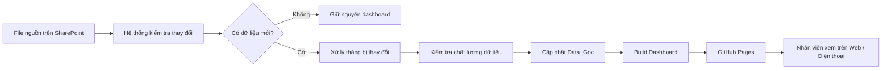
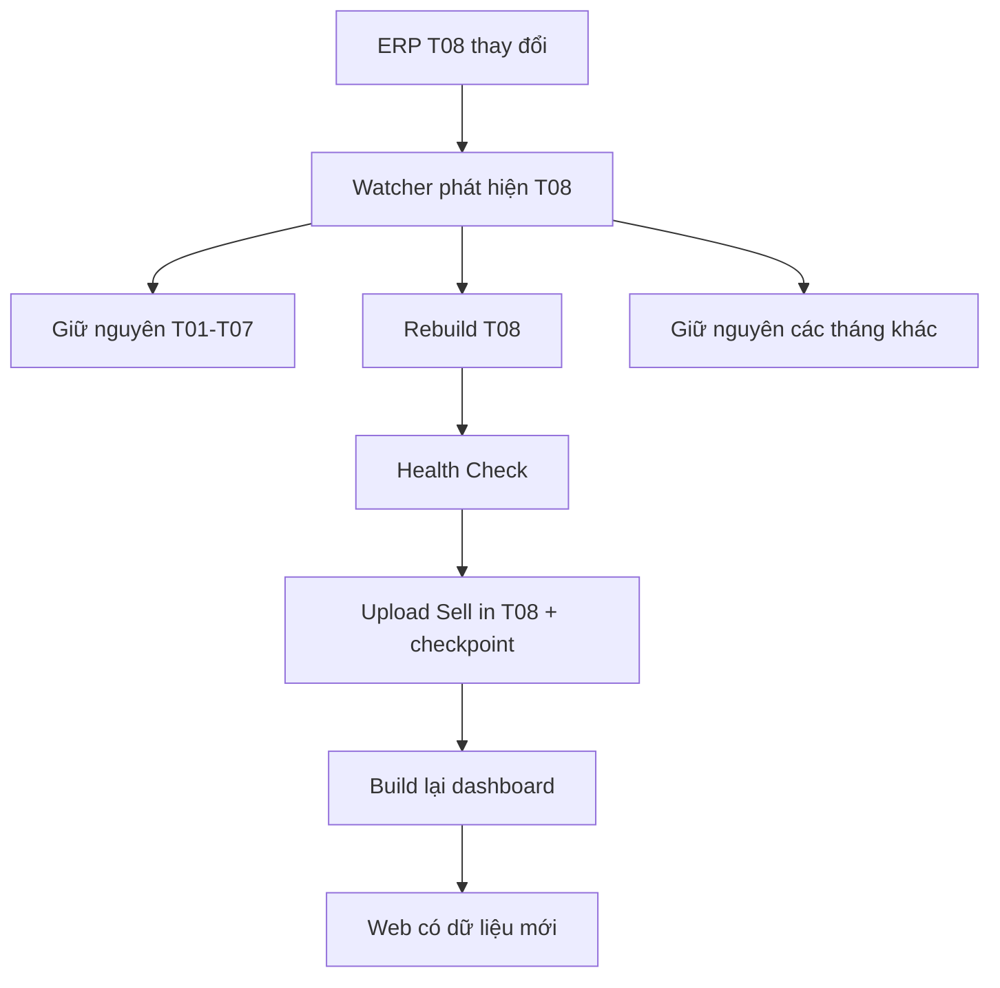

# HƯỚNG DẪN NHÂN VIÊN VIKODA — SELL-IN DASHBOARD

> Tài liệu này dành cho nhân viên Vikoda sử dụng dashboard trong công việc hằng ngày. Không cần biết lập trình, GitHub hay Microsoft Graph.

## 1. Mở dashboard

**Dashboard:** https://huanpro1239.github.io/vikoda-sellin-dashboard/

Trên máy tính: mở link bằng Chrome, Edge, Safari hoặc Firefox phiên bản mới.

Trên điện thoại: mở cùng link. Giao diện tự chuyển sang chế độ mobile.

### Trên điện thoại

- Thanh dưới màn hình dùng để chuyển nhanh 6 trang.
- Bấm **Bộ lọc** ở góc trên để chọn kỳ, Kênh, Miền, Vùng, Group Brand.
- Các biểu đồ 12 tháng có thể **vuốt ngang** để xem đủ dữ liệu.
- Các bảng lớn có thể **vuốt ngang và dọc**.
- Có thể xoay ngang điện thoại khi cần xem bảng/biểu đồ rộng hơn.

---

## 2. Dashboard dùng để trả lời câu hỏi gì?

| Trang | Dùng khi cần biết |
|---|---|
| **01. Tổng quan** | Doanh thu hiện tại là bao nhiêu? So với cùng kỳ và Target thế nào? Vùng/Sản phẩm nào đóng góp nhiều nhất? |
| **02. Vùng - Miền** | Miền, Vùng, Tỉnh nào đang tốt hoặc cần ưu tiên? |
| **03. Khách hàng** | Khách hàng nào đóng góp lớn? Khách nào tăng/giảm? Diễn biến theo tháng ra sao? |
| **04. Sale quản lý** | Vùng/Kênh nào đạt Target? Đơn vị nào cần hỗ trợ? Xem chi tiết khách hàng và sản phẩm. |
| **05. Sản phẩm** | Group Brand, Brand, SKU nào đang dẫn đầu hoặc suy giảm? |
| **06. Chênh lệch** | Phần thiếu/vượt Target đến từ Vùng/Miền nào? |

---

## 3. Hiểu 5 KPI chính

Dashboard luôn hiển thị 5 KPI ở đầu trang:

| KPI | Ý nghĩa |
|---|---|
| **Actual** | Doanh thu thực tế của kỳ đang chọn |
| **Cùng kỳ** | Doanh thu cùng khoảng thời gian của năm trước |
| **Target** | Kế hoạch doanh thu của kỳ đang chọn |
| **% Đạt Target** | `Actual / Target × 100%` |
| **Tăng trưởng** | So sánh Actual với cùng kỳ năm trước |

Ví dụ:

```text
Actual        = 10.000 tr
Cùng kỳ       = 9.000 tr
Target        = 11.000 tr
% Đạt Target  = 90,9%
Tăng trưởng   = +11,1%
```

Cách đọc: doanh thu tăng so với năm trước nhưng vẫn chưa đạt kế hoạch.

---

## 4. Cách dùng bộ lọc

Có thể lọc theo:

```text
Kỳ báo cáo
Kênh
Miền
Vùng
Group Brand / Nhóm sản phẩm
```

Các nút kỳ nhanh:

- **MTD**: từ đầu tháng đến ngày dữ liệu mới nhất.
- **QTD**: từ đầu quý đến ngày dữ liệu mới nhất.
- **YTD**: từ đầu năm đến ngày dữ liệu mới nhất.
- **Toàn bộ**: toàn bộ khoảng dữ liệu đang có.

Khi chọn bộ lọc, KPI, biểu đồ và bảng sẽ tính lại theo cùng điều kiện.

### Lưu ý khi so sánh

Trước khi kết luận số liệu, luôn kiểm tra:

1. Kỳ đang chọn.
2. Kênh/Miền/Vùng đang lọc.
3. Dòng `AUTO SYNC · dữ liệu đến ...` ở đầu dashboard.

---

## 5. Quy trình dữ liệu hoạt động như thế nào?

Nhân viên chỉ cần hiểu luồng tổng quát dưới đây:



Hệ thống kiểm tra SharePoint theo lịch khoảng 30 phút/lần. Khi không có thay đổi, hệ thống dừng sớm để không xử lý lại dữ liệu không cần thiết.

---

## 6. Ví dụ khi ERP tháng 08 được cập nhật



Điều này giúp hệ thống nhanh hơn và tránh tạo lại toàn bộ lịch sử mỗi lần một tháng thay đổi.

---

## 7. Khi nào số liệu trên web thay đổi?

Bình thường:

```text
SharePoint cập nhật
→ hệ thống phát hiện
→ xử lý dữ liệu
→ kiểm tra PASS
→ deploy web
```

Chỉ sau khi các bước kiểm tra thành công thì dashboard mới được cập nhật.

Nếu file nguồn lỗi hoặc dữ liệu không đạt kiểm tra, hệ thống giữ bản dashboard trước đó thay vì publish bản lỗi.

---

## 8. Nếu dashboard chưa cập nhật

Kiểm tra lần lượt:

1. Xem dòng **AUTO SYNC · dữ liệu đến ...** trên dashboard.
2. Làm mới trang.
3. Trên máy tính có thể dùng `Ctrl + F5` để bỏ cache.
4. Trên điện thoại đóng tab và mở lại dashboard.
5. Nếu vẫn sai, gửi cho người phụ trách:
   - ảnh màn hình;
   - trang dashboard đang xem;
   - kỳ/Kênh/Miền/Vùng đang lọc;
   - số liệu bạn kỳ vọng;
   - thời điểm file SharePoint được cập nhật.

Không nên chỉ báo “dashboard sai” mà không kèm kỳ và bộ lọc, vì cùng một KPI sẽ khác nhau theo điều kiện lọc.

---

## 9. Nếu giao diện điện thoại khó xem

- Dùng chế độ dọc để xem KPI và các card.
- Dùng chế độ ngang để xem biểu đồ/bảng rộng.
- Vuốt ngang ở vùng có dòng **“Vuốt ngang để xem đầy đủ dữ liệu”**.
- Với bảng, chạm và kéo trực tiếp trong bảng.
- Không cần zoom toàn bộ trang bằng hai ngón; dashboard đã tự bố trí cho màn hình nhỏ.

---

## 10. Dữ liệu nào đang được sử dụng?

Nguồn chính nằm trên SharePoint:

```text
Vikoda_Sales_Data/
├── Data ERP/
├── Target/
├── DanhMuc_KH/
├── DanhMuc_SP/
└── Data_Goc/
```

- `Data ERP`: dữ liệu Sell-In nguồn.
- `Target`: kế hoạch.
- `DanhMuc_KH`: thông tin khách hàng, Kênh, Miền, Vùng, Tỉnh.
- `DanhMuc_SP`: thông tin sản phẩm.
- `Data_Goc`: dữ liệu đã xử lý dùng cho báo cáo.

---

## 11. Ai làm gì?

### Nhân viên sử dụng dashboard

- Xem báo cáo.
- Chọn đúng kỳ/bộ lọc.
- Phản hồi khi phát hiện số liệu hoặc giao diện bất thường.

### Người phụ trách dữ liệu/kế hoạch

- Đảm bảo file nguồn SharePoint đúng cấu trúc.
- Kiểm tra dữ liệu ERP, Target, danh mục KH/SP.
- Chạy workflow thủ công khi cần kiểm tra ngay.

### Người bảo trì kỹ thuật

- Theo dõi GitHub Actions.
- Bảo trì ETL/incremental logic.
- Bảo trì dashboard và test.
- Kiểm tra Microsoft Graph/OIDC khi kết nối SharePoint gặp lỗi.

---

## 12. Lưu ý về đường link web

Dashboard hiện được publish bằng **GitHub Pages**. Theo cấu hình hiện tại, web publish đầy đủ payload dashboard và URL là public.

Không đặt mật khẩu, token, secret hoặc thông tin đăng nhập vào file GitHub/README/dashboard.

---

## 13. Tài liệu dành cho người bảo trì

- [README — Tổng quan hệ thống](README.md)
- [Runbook SharePoint + GitHub Actions](HUONG_DAN_SHAREPOINT_GITHUB_ACTIONS.md)

Nếu chỉ sử dụng dashboard hằng ngày, bạn không cần đọc runbook kỹ thuật.
