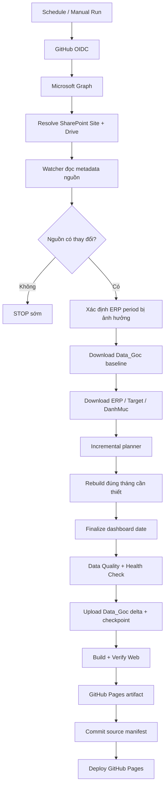
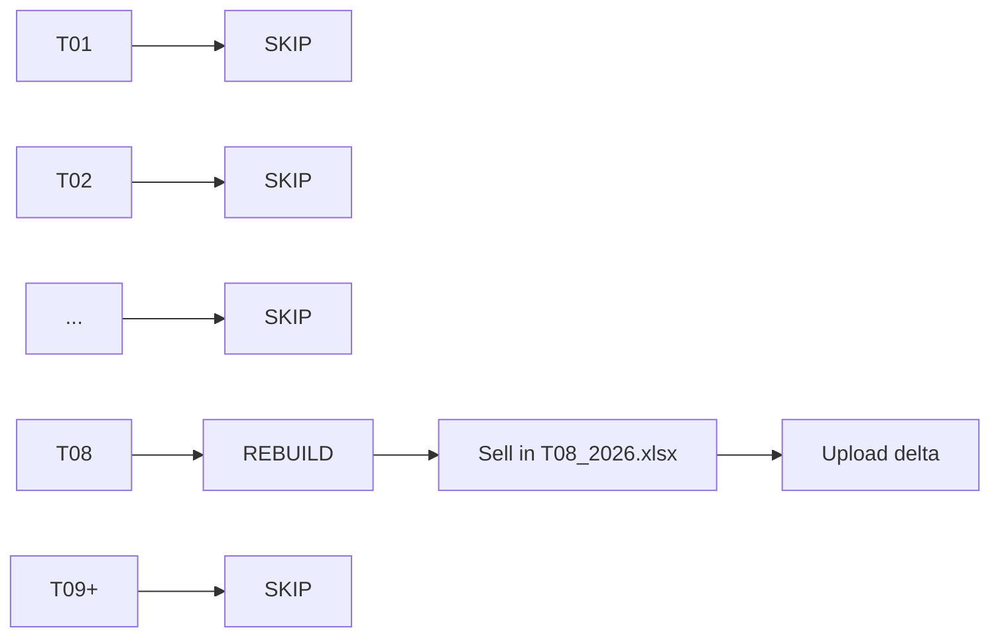
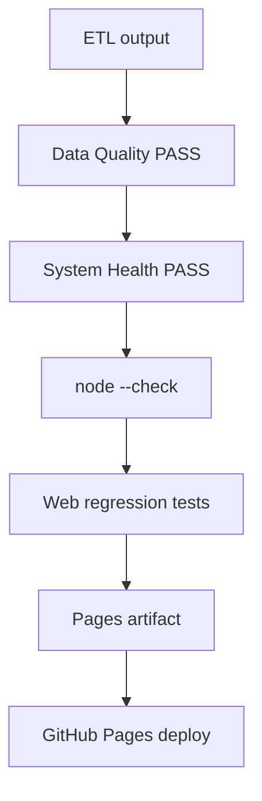
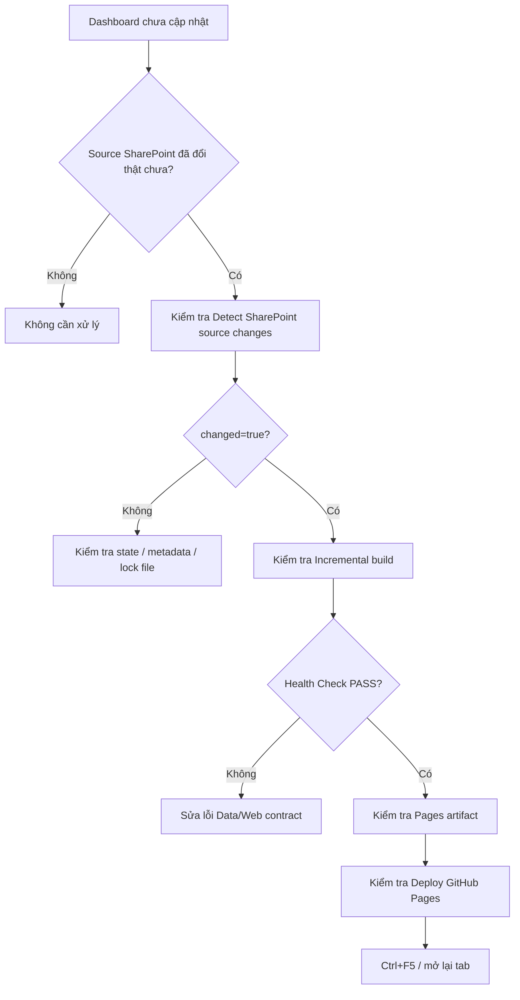

# RUNBOOK KỸ THUẬT — VIKODA SELL-IN DASHBOARD

> Dành cho người vận hành/bảo trì hệ thống. Nhân viên chỉ cần xem dashboard nên đọc [HUONG_DAN_NHAN_VIEN_VIKODA.md](HUONG_DAN_NHAN_VIEN_VIKODA.md).

## 1. Mục tiêu hệ thống

```text
SharePoint là nguồn dữ liệu
→ GitHub Actions tự kiểm tra thay đổi
→ chỉ xử lý tháng bị ảnh hưởng
→ kiểm tra chất lượng
→ build web
→ deploy GitHub Pages
```

Không dùng Power Automate Premium. Production dùng GitHub OIDC thay vì Client Secret dài hạn.

---

## 2. Sơ đồ production



Nếu `F = Không`, các bước download/ETL/deploy phía sau không chạy.

---

## 3. SharePoint contract

```text
Shared Documents/
└── Vikoda_Sales_Data/
    ├── Data ERP/
    ├── Target/
    ├── DanhMuc_KH/
    │   └── Thong tin khach hang.xlsx
    ├── DanhMuc_SP/
    │   └── Danh Muc San Pham.xlsx
    └── Data_Goc/
        ├── Sell in Txx_yyyy.xlsx
        ├── _vikoda_pipeline_state.json
        └── _vikoda_incremental_state.json
```

Không đổi tên folder contract nếu chưa cập nhật workflow và code liên quan.

---

## 4. Incremental Data_Goc

Ví dụ ERP tháng 08/2026 thay đổi:



Delta bình thường:

```text
Sell in T08_2026.xlsx
_vikoda_incremental_state.json
```

Nếu không có workbook cần rebuild nhưng state cần cập nhật, uploader vẫn cho phép upload checkpoint `_vikoda_*.json`.

---

## 5. Hai state file dùng để làm gì?

### Source manifest

```text
Data_Goc/_vikoda_pipeline_state.json
```

Lưu metadata/fingerprint của file nguồn để watcher biết SharePoint có thay đổi hay không.

### Incremental state

```text
Data_Goc/_vikoda_incremental_state.json
```

Dùng để planner quyết định tháng nào `REBUILD` hoặc `SKIP`.

**Quy tắc:** state chỉ được commit/upload sau khi pipeline thành công.

---

## 6. Microsoft Entra + GitHub OIDC

Repository Variables bắt buộc:

```text
AZURE_TENANT_ID
AZURE_CLIENT_ID
```

Production không dùng:

```text
AZURE_CLIENT_SECRET
```

Graph authorization:

```text
Application permission: Sites.Selected
Planning site role: write
```

Federated identity:

```text
Repository: Huanpro1239/vikoda-sellin-dashboard
Branch: main
Issuer: https://token.actions.githubusercontent.com
Audience: api://AzureADTokenExchange
```

---

## 7. Workflow và trigger

Workflow:

```text
.github/workflows/vikoda_pipeline.yml
```

Schedule:

```text
*/30 * * * *
```

| Trigger | Kết quả |
|---|---|
| Pull request | Python/Web test + hygiene |
| Push `main` | Read-only CI |
| Schedule | Kiểm tra metadata SharePoint |
| Schedule + không đổi | STOP sớm |
| Schedule + có đổi | Incremental refresh + Pages deploy |
| Manual dispatch | Force source check + incremental planner + Pages deploy |

GitHub schedule có thể chạy lệch vài phút so với đúng mốc cron.

---

## 8. Chạy manual đúng cách

```text
Repository
→ Actions
→ Vikoda Sell-In Pipeline
→ Run workflow
→ Branch: main
→ run_cloud_refresh = true
```

Sau khi code vừa được sửa:

```text
KHÔNG rerun run cũ
→ tạo workflow run mới trên main
```

Lý do: rerun cũ vẫn chạy theo commit SHA cũ.

---

## 9. Checklist một run thành công

Các bước sau phải `success`:

```text
Validate Microsoft OIDC configuration
Azure login with GitHub OIDC for Microsoft Graph
Resolve SharePoint site and drive IDs
Detect SharePoint source changes and affected ERP periods
Rebuild only changed Data_Goc periods and dashboard data
Finalize dashboard date from latest invoice
Run system health check
Upload only changed Data_Goc files and checkpoint
Validate generated dashboard
Verify full dashboard payload exists
Upload full dashboard as GitHub Pages artifact
Commit successful SharePoint source manifest
Deploy full dashboard to GitHub Pages
```

Cloud summary nên cho biết:

```text
Source change
ERP periods changed
Data_Goc periods rebuilt
Data_Goc workbooks rebuilt
GitHub Pages payload
```

---

## 10. Web release gate



Web runtime:

```text
web/data/dashboard_data.json
web/data/dashboard_data.js
```

Hai file runtime không commit trực tiếp vào Git. Workflow tạo trong runner rồi publish artifact.

---

## 11. Dashboard release layers

```text
Base UI
  web/css/executive-dashboard.css

Power BI visual layers
  web/css/reference-fidelity-v4.css
  web/js/reference-fidelity-v4.js

Sale management V5
  web/css/page05-sale-v5.css
  web/js/page05-sale-v5.js

Mobile V6
  web/css/mobile-v6.css
  web/js/mobile-v6.js
```

Mobile V6 đảm bảo:

```text
≤ 900px        → mobile layout
KPI            → 2 cột
Sidebar filter → drawer
Navigation     → fixed bottom bar
12-month chart → horizontal swipe
Matrix/table   → horizontal + vertical scroll
iPhone         → safe-area support
Orientation    → ECharts resize
```

---

## 12. Test trước release

```bash
python -m pip install -r requirements.txt
python code/run_all_tests.py --quiet
npm run verify:web
```

Production health check:

```bash
python code/health_check.py
```

`code/health_check.py` phải biết tất cả asset bắt buộc của release hiện tại.

---

# TROUBLESHOOTING

## 13. Sơ đồ xử lý khi dashboard chưa cập nhật



---

## 14. AADSTS700213

Nguyên nhân: Federated Credential không khớp GitHub OIDC subject/issuer/audience.

Kiểm tra:

```text
repository
branch main
issuer
audience
federated subject
```

---

## 15. Graph 403

Kiểm tra:

```text
Sites.Selected
Admin consent
Planning site permission = write
```

---

## 16. Graph 404

Kiểm tra folder/path:

```text
Vikoda_Sales_Data/Data ERP
Vikoda_Sales_Data/Target
Vikoda_Sales_Data/DanhMuc_KH
Vikoda_Sales_Data/DanhMuc_SP
Vikoda_Sales_Data/Data_Goc
```

---

## 17. Data_Goc baseline missing

Incremental planner cần baseline hợp lệ để giữ các tháng không đổi.

Kiểm tra `Data_Goc/` trên SharePoint có các workbook `Sell in Txx_yyyy.xlsx` cần thiết.

---

## 18. Health Check báo Web files FAIL

Kiểm tra `REQUIRED_WEB_FILES` trong:

```text
code/health_check.py
```

Nếu vừa thêm/xóa CSS/JS release layer, phải cập nhật health contract và `package.json`.

---

## 19. Dashboard mobile bị nén hoặc bảng quá rộng

Kiểm tra:

```text
web/css/mobile-v6.css
web/js/mobile-v6.js
```

Sau sửa giao diện:

```text
npm run verify:web
→ manual workflow mới trên main
→ mở điện thoại và reload
```

Không nên ép chart 12 tháng xuống 360px. Mobile V6 chủ động cho phép vuốt ngang để giữ khả năng đọc nhãn.

---

## 20. Pages deploy fail

Kiểm tra:

```text
Settings
→ Pages
→ Source = GitHub Actions
```

Và job cloud refresh phải tạo Pages artifact thành công.

---

## 21. Dashboard web vẫn là bản cũ

Trình tự kiểm tra:

```text
Workflow head SHA đúng commit mới?
→ Deploy job success?
→ URL đúng repository?
→ Ctrl+F5 / đóng mở lại tab mobile
```

---

# QUY TẮC BẢO TRÌ

1. Không commit token, secret hoặc `.env`.
2. Không reintroduce `AZURE_CLIENT_SECRET`.
3. Không commit `Data/` hoặc generated `web/data/`.
4. Giữ `Data_Goc` là managed output.
5. Không phá incremental planner khi sửa ETL.
6. Thay đổi SharePoint contract phải cập nhật workflow + README + runbook.
7. Thêm/xóa web release asset phải cập nhật `package.json` + `code/health_check.py`.
8. Sau thay đổi cloud logic hoặc UI release layer, chạy manual validation trên `main`.
9. Dashboard GitHub Pages hiện publish full payload và là public.

---

## Tài liệu liên quan

- [README — Tổng quan hệ thống](README.md)
- [Hướng dẫn nhân viên Vikoda](HUONG_DAN_NHAN_VIKODA.md)
