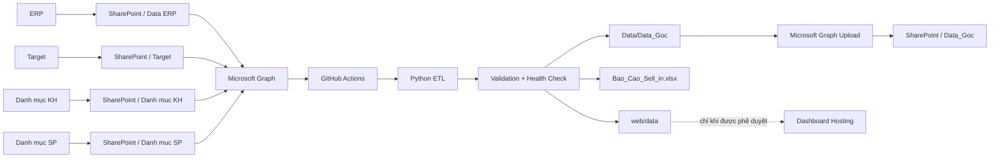

# VIKODA SELL-IN MANAGEMENT & AUTOMATION PLATFORM

Nền tảng xử lý, đối soát và báo cáo Sell-In của Vikoda theo kiến trúc cloud không phụ thuộc máy tính cá nhân.

> **Kiến trúc chính thức:** SharePoint Online → Microsoft Graph → GitHub Actions → Python ETL → SharePoint `Data_Goc`.
>
> Dự án không dùng Flow/webhook trung gian để kích hoạt pipeline. GitHub Actions chạy theo lịch hoặc chạy thủ công và truy cập SharePoint trực tiếp bằng Microsoft Graph.

## 1. Mục tiêu hệ thống

Hệ thống tự động hóa các công việc sau:

- Đọc file ERP từ SharePoint `Data ERP`.
- Đọc Target, danh mục khách hàng và danh mục sản phẩm từ SharePoint.
- Chuẩn hóa và tách dữ liệu Sell-In theo tháng.
- Sinh các workbook `Sell in TMM_YYYY.xlsx`.
- Tạo báo cáo tổng hợp `Bao_Cao_Sell_in.xlsx` và dữ liệu Web Dashboard.
- Chạy validation, health check và test trước khi ghi đầu ra.
- Upload các workbook đã xử lý về SharePoint `Data_Goc`.
- Cho phép publish dashboard có kiểm soát khi dữ liệu đã được phân loại là public/sanitized.

## 2. Kiến trúc vận hành chuẩn



### Nguyên tắc vận hành

1. **SharePoint là nguồn dữ liệu nghiệp vụ.** Không dùng Git làm nơi lưu workbook sản xuất.
2. **GitHub Actions là bộ lập lịch và máy chạy ETL.** Lịch mặc định là 18:00 giờ Việt Nam (`11:00 UTC`).
3. **Microsoft Graph là lớp đồng bộ hai chiều.** App Entra ID chỉ được cấp quyền cần thiết cho site `Planning`.
4. **Pipeline fail-closed.** Thiếu credential, thiếu workbook nguồn hoặc validation không đạt thì dừng; không dùng dữ liệu cũ để báo xanh giả.
5. **Dashboard không tự động công khai dữ liệu nội bộ.** Publish chỉ chạy khi có cờ phê duyệt rõ ràng.

## 3. Workflow GitHub Actions

Dự án sử dụng một workflow chính:

```text
.github/workflows/vikoda_pipeline.yml
```

Workflow xử lý bốn tình huống:

| Trigger | Mục đích | Dùng SharePoint Secret |
|---|---|---|
| Pull request | Kiểm tra code, test, chặn dữ liệu sản xuất vào Git | Không |
| Push `main` | CI kiểm tra code | Không |
| Schedule 18:00 VN | Refresh dữ liệu SharePoint → ETL → upload `Data_Goc` | Có |
| Manual dispatch | Refresh ngay; tùy chọn publish dashboard đã được phê duyệt | Có |

### Pipeline cloud

```text
Preflight Entra/SharePoint
        ↓
Download Data ERP
        ↓
Download Target
        ↓
Download Danh muc KH
        ↓
Download Danh muc SP
        ↓
run_cloud_pipeline.py --strict
        ↓
finalize_data_dates.py
        ↓
health_check.py
        ↓
Verify Data/Data_Goc/*.xlsx
        ↓
Upload Data_Goc → SharePoint
```

## 4. Cấu hình Microsoft Entra ID

App gợi ý:

```text
vikoda-sellin-github-actions
```

Mô hình xác thực hiện tại là OAuth2 Client Credentials với Microsoft Graph.

### GitHub Repository Secrets bắt buộc

```text
AZURE_TENANT_ID
AZURE_CLIENT_ID
AZURE_CLIENT_SECRET
```

`AZURE_CLIENT_SECRET` phải là **Value** của Client Secret, không phải Secret ID.

### Secrets tùy chọn

Hai ID sau có thể để trống vì `code/common/sharepoint_bootstrap.py` có thể tự resolve:

```text
SHAREPOINT_SITE_ID
SHAREPOINT_DRIVE_ID
```

### Repository Variables

```text
SHAREPOINT_HOSTNAME=vikodacomvn.sharepoint.com
SHAREPOINT_SITE_PATH=/sites/Planning
SHAREPOINT_ERP_FOLDER=Data ERP
SHAREPOINT_TARGET_FOLDER=Target
SHAREPOINT_CUSTOMER_FOLDER=Danh muc KH
SHAREPOINT_PRODUCT_FOLDER=Danh muc SP
SHAREPOINT_DATA_GOC_FOLDER=Data_Goc
```

## 5. Quyền SharePoint

Khuyến nghị dùng Microsoft Graph Application permission:

```text
Sites.Selected
```

Sau khi Admin consent, cấp riêng app quyền `write` trên site:

```text
https://vikodacomvn.sharepoint.com/sites/Planning
```

Không cấp quyền rộng hơn nếu không có yêu cầu nghiệp vụ rõ ràng.

## 6. Cấu trúc dữ liệu

```text
SharePoint / Planning
├── Data ERP/        # file ERP nguồn
├── Target/          # kế hoạch doanh số
├── Danh muc KH/     # master khách hàng
├── Danh muc SP/     # master sản phẩm
└── Data_Goc/        # workbook tháng đã xử lý
```

Trong GitHub runner, dữ liệu tạm nằm ở:

```text
Data/CloudInputs/ERP
Data/CloudInputs/Target
Data/CloudInputs/DMKH
Data/CloudInputs/DMSP
Data/Data_Goc
Data/File bao cao
web/data
```

Các thư mục dữ liệu sản xuất không được commit trở lại repository.

## 7. Sử dụng theo vai trò

### Sales Admin / Kế toán

1. Xuất file ERP theo định dạng đang được pipeline hỗ trợ.
2. Upload file vào SharePoint `Data ERP`.
3. Không đổi tên/cấu trúc các thư mục SharePoint khi chưa cập nhật Repository Variables.
4. Chờ lần refresh kế tiếp hoặc yêu cầu quản trị viên chạy workflow thủ công.
5. Kiểm tra `Data_Goc` sau khi workflow hoàn tất.

### Quản trị hệ thống

Chạy ngay:

```text
GitHub → Actions → Vikoda Sell-In Pipeline → Run workflow
```

Giữ `run_cloud_refresh = true`.

Chỉ bật `publish_dashboard = true` khi đồng thời đã cấu hình:

```text
ENABLE_PAGES_DEPLOY=true
WEB_DATA_CLASSIFICATION=public-or-sanitized
```

Nếu dữ liệu chứa khách hàng, doanh thu chi tiết hoặc thông tin nội bộ chưa sanitize thì **không publish lên static hosting**.

### Chạy local

Cài dependency:

```bash
py -3.12 -m pip install -r requirements.txt
```

Chạy pipeline local:

```bash
py -3.12 code/Skill/skill-bao-cao/scripts/run_cloud_pipeline.py --project-root .
```

Có thể dùng OneDrive Sync + watcher PowerShell như phương án dự phòng trên Windows; đây không phải luồng cloud chính và yêu cầu máy tính đang hoạt động.

## 8. Kiểm thử

Python:

```bash
python code/run_all_tests.py --quiet
```

Web:

```bash
npm run verify:web
```

Cloud pipeline còn chạy thêm `health_check.py` trước khi upload đầu ra về SharePoint.

## 9. Bảo mật

- Không commit `.env`, token, Client Secret hoặc workbook sản xuất.
- Không ghi raw ERP, staging data hoặc `web/data` sản xuất vào Git.
- Client-side password không phải access control.
- Thu hồi Client Secret ngay khi nghi ngờ bị lộ.
- CI cho PR/push chỉ dùng quyền `contents: read` và không nhận production secrets.
- Chỉ job deploy dashboard mới được cấp `pages: write` và `id-token: write`.

Xem thêm [`SECURITY.md`](SECURITY.md).

## 10. Tài liệu vận hành

Hướng dẫn cấu hình và kiểm tra end-to-end:

[`HUONG_DAN_SHAREPOINT_GITHUB_ACTIONS.md`](HUONG_DAN_SHAREPOINT_GITHUB_ACTIONS.md)

---

**Vikoda Sell-In Platform — SharePoint + Microsoft Graph + GitHub Actions + Python.**
