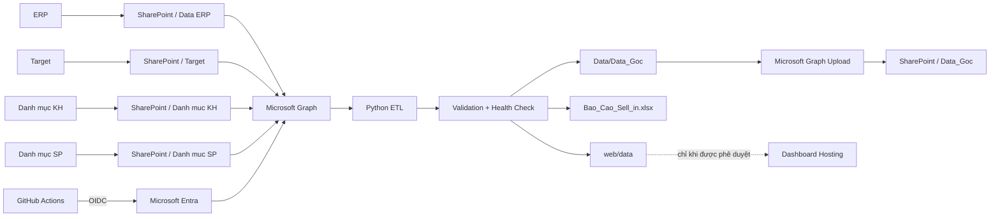

# VIKODA SELL-IN MANAGEMENT & AUTOMATION PLATFORM

Nền tảng xử lý, đối soát và báo cáo Sell-In của Vikoda theo kiến trúc cloud không phụ thuộc máy tính cá nhân.

> **Kiến trúc chính thức:** SharePoint Online → Microsoft Graph → GitHub Actions OIDC → Python ETL → SharePoint `Data_Goc`.
>
> Dự án không dùng Power Automate/Flow/webhook trung gian và không dùng Azure Client Secret dài hạn.

## 1. Mục tiêu hệ thống

Hệ thống tự động hóa các công việc sau:

- Đọc file ERP từ SharePoint `Data ERP`.
- Đọc Target, danh mục khách hàng và danh mục sản phẩm từ SharePoint.
- Chuẩn hóa và tách dữ liệu Sell-In theo tháng.
- Sinh các workbook `Sell in TMM_YYYY.xlsx`.
- Tạo báo cáo tổng hợp `Bao_Cao_Sell_in.xlsx` và dữ liệu Web Dashboard.
- Chạy validation, health check và test trước khi ghi đầu ra.
- Upload các workbook đã xử lý về SharePoint `Data_Goc`.
- Cho phép publish dashboard có kiểm soát khi dữ liệu đã được phân loại là public/sanitized.

## 2. Kiến trúc vận hành chuẩn



### Nguyên tắc vận hành

1. **SharePoint là nguồn dữ liệu nghiệp vụ.** Không dùng Git làm nơi lưu workbook sản xuất.
2. **GitHub Actions là bộ lập lịch và máy chạy ETL.** Lịch mặc định là 18:00 giờ Việt Nam (`11:00 UTC`).
3. **GitHub OIDC là cơ chế xác thực cloud.** Không lưu Client Secret dài hạn trong GitHub.
4. **Microsoft Graph là lớp đồng bộ hai chiều.** App Entra ID chỉ được cấp quyền cần thiết cho site `Planning`.
5. **Pipeline fail-closed.** Thiếu cấu hình, thiếu workbook nguồn hoặc validation không đạt thì dừng; không dùng dữ liệu cũ để báo xanh giả.
6. **Dashboard không tự động công khai dữ liệu nội bộ.** Publish chỉ chạy khi có cờ phê duyệt rõ ràng.

## 3. Workflow GitHub Actions

Dự án sử dụng một workflow chính:

```text
.github/workflows/vikoda_pipeline.yml
```

| Trigger | Mục đích | OIDC/SharePoint |
|---|---|---|
| Pull request | Kiểm tra code, test, chặn dữ liệu sản xuất vào Git | Không |
| Push `main` | CI kiểm tra code | Không |
| Schedule 18:00 VN | Refresh dữ liệu SharePoint → ETL → upload `Data_Goc` | Có |
| Manual dispatch | Refresh ngay; tùy chọn publish dashboard đã được phê duyệt | Có |

### Pipeline cloud

```text
Validate OIDC configuration
        ↓
azure/login (GitHub OIDC)
        ↓
Resolve SharePoint site/drive
        ↓
Download Data ERP / Target / DMKH / DMSP
        ↓
run_cloud_pipeline.py --strict
        ↓
finalize_data_dates.py
        ↓
health_check.py
        ↓
Verify Data/Data_Goc/*.xlsx
        ↓
Upload Data_Goc → SharePoint
```

## 4. Microsoft Entra ID + GitHub OIDC

App gợi ý:

```text
vikoda-sellin-github-actions
```

Supported account type:

```text
Accounts in this organizational directory only (Single tenant)
```

### Federated Credential bắt buộc

Trong Entra App:

```text
Certificates & secrets
→ Federated credentials
→ Add credential
→ GitHub Actions deploying Azure resources
```

Cấu hình cho repository này:

```text
Organization: Huanpro1239
Repository: vikoda-sellin-dashboard
Entity type: Branch
GitHub branch name: main
```

Federated credential tương ứng có:

```text
Issuer: https://token.actions.githubusercontent.com
Subject: repo:Huanpro1239/vikoda-sellin-dashboard:ref:refs/heads/main
Audience: api://AzureADTokenExchange
```

Không cần tạo `AZURE_CLIENT_SECRET`.

## 5. GitHub Repository Variables

Vào:

```text
Settings → Secrets and variables → Actions → Variables
```

Tạo hai biến OIDC bắt buộc:

```text
AZURE_TENANT_ID=<Directory tenant ID>
AZURE_CLIENT_ID=<Application client ID của vikoda-sellin-github-actions>
```

Hai ID này là identifier, không phải mật khẩu nên có thể lưu dưới Repository Variables.

Tạo thêm các biến SharePoint:

```text
SHAREPOINT_HOSTNAME=vikodacomvn.sharepoint.com
SHAREPOINT_SITE_PATH=/sites/Planning
SHAREPOINT_ERP_FOLDER=Data ERP
SHAREPOINT_TARGET_FOLDER=Target
SHAREPOINT_CUSTOMER_FOLDER=Danh muc KH
SHAREPOINT_PRODUCT_FOLDER=Danh muc SP
SHAREPOINT_DATA_GOC_FOLDER=Data_Goc
```

`SHAREPOINT_SITE_ID` và `SHAREPOINT_DRIVE_ID` là tùy chọn; `code/common/sharepoint_bootstrap.py` sẽ tự resolve nếu để trống.

## 6. Quyền SharePoint

Khuyến nghị Microsoft Graph Application permission:

```text
Sites.Selected
```

Sau khi Admin consent, cấp riêng app quyền:

```text
Site: https://vikodacomvn.sharepoint.com/sites/Planning
Role: write
```

Không cấp quyền rộng hơn nếu không có yêu cầu nghiệp vụ rõ ràng.

## 7. Cấu trúc dữ liệu

```text
SharePoint / Planning
├── Data ERP/
├── Target/
├── Danh muc KH/
├── Danh muc SP/
└── Data_Goc/
```

Trong GitHub runner, dữ liệu tạm nằm ở:

```text
Data/CloudInputs/ERP
Data/CloudInputs/Target
Data/CloudInputs/DMKH
Data/CloudInputs/DMSP
Data/Data_Goc
Data/File bao cao
web/data
```

Các thư mục dữ liệu sản xuất không được commit trở lại repository.

## 8. Sử dụng theo vai trò

### Sales Admin / Kế toán

1. Xuất file ERP theo định dạng pipeline hỗ trợ.
2. Upload file vào SharePoint `Data ERP`.
3. Không đổi tên/cấu trúc các thư mục SharePoint khi chưa cập nhật Repository Variables.
4. Chờ lần refresh kế tiếp hoặc yêu cầu quản trị viên chạy workflow thủ công.
5. Kiểm tra `Data_Goc` sau khi workflow hoàn tất.

### Quản trị hệ thống

Chạy ngay:

```text
GitHub → Actions → Vikoda Sell-In Pipeline → Run workflow
```

Giữ:

```text
run_cloud_refresh = true
publish_dashboard = false
```

Chỉ bật `publish_dashboard = true` khi đồng thời đã cấu hình:

```text
ENABLE_PAGES_DEPLOY=true
WEB_DATA_CLASSIFICATION=public-or-sanitized
```

Nếu dữ liệu chứa khách hàng, doanh thu chi tiết hoặc thông tin nội bộ chưa sanitize thì **không publish lên static hosting**.

### Chạy local

Cài dependency:

```bash
py -3.12 -m pip install -r requirements.txt
```

Đăng nhập Azure CLI:

```bash
az login --tenant <AZURE_TENANT_ID> --allow-no-subscriptions
```

Sau đó có thể chạy bootstrap/Graph hoặc ETL local theo nhu cầu. OneDrive Sync + watcher PowerShell chỉ là phương án dự phòng trên Windows, không phải luồng cloud chính.

## 9. Kiểm thử

Python:

```bash
python code/run_all_tests.py --quiet
```

Web:

```bash
npm run verify:web
```

Cloud pipeline còn chạy `health_check.py` trước khi upload đầu ra về SharePoint.

## 10. Bảo mật

- Không commit `.env`, token hoặc workbook sản xuất.
- Không dùng Azure Client Secret cho cloud workflow.
- GitHub OIDC token là ngắn hạn và chỉ được Entra chấp nhận khi federated credential khớp repository/branch.
- Không ghi raw ERP, staging data hoặc `web/data` sản xuất vào Git.
- Client-side password không phải access control.
- CI cho PR/push chỉ dùng quyền `contents: read`; job cloud mới có `id-token: write`.
- Chỉ job deploy dashboard mới được cấp quyền Pages.

Xem thêm [`SECURITY.md`](SECURITY.md).

## 11. Tài liệu vận hành

Hướng dẫn cấu hình và kiểm tra end-to-end:

[`HUONG_DAN_SHAREPOINT_GITHUB_ACTIONS.md`](HUONG_DAN_SHAREPOINT_GITHUB_ACTIONS.md)

---

**Vikoda Sell-In Platform — SharePoint + Microsoft Graph + GitHub Actions OIDC + Python.**
