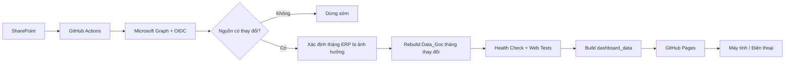
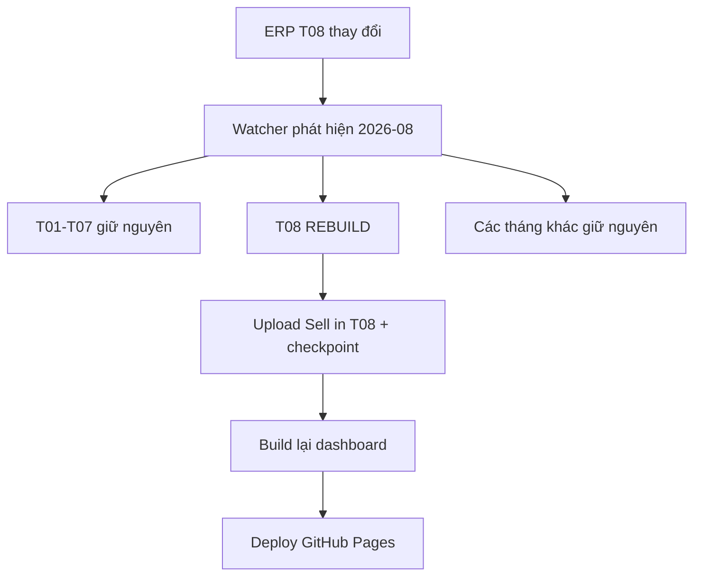
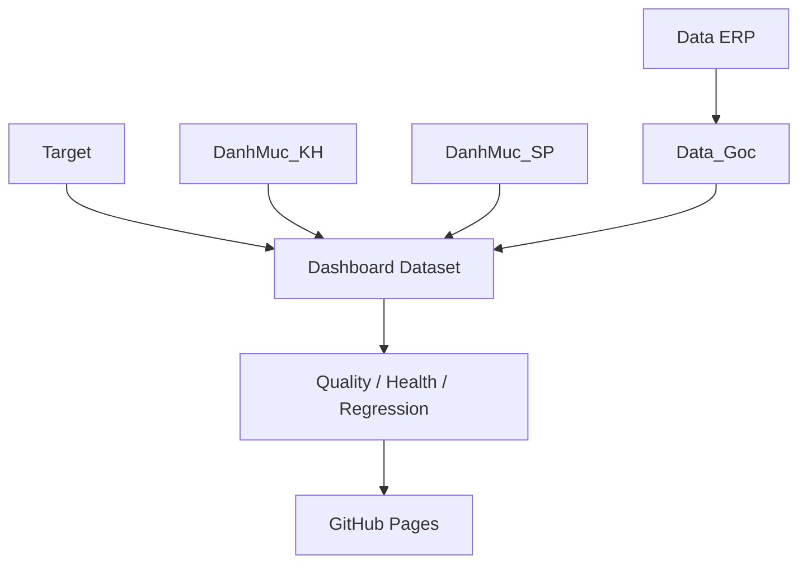
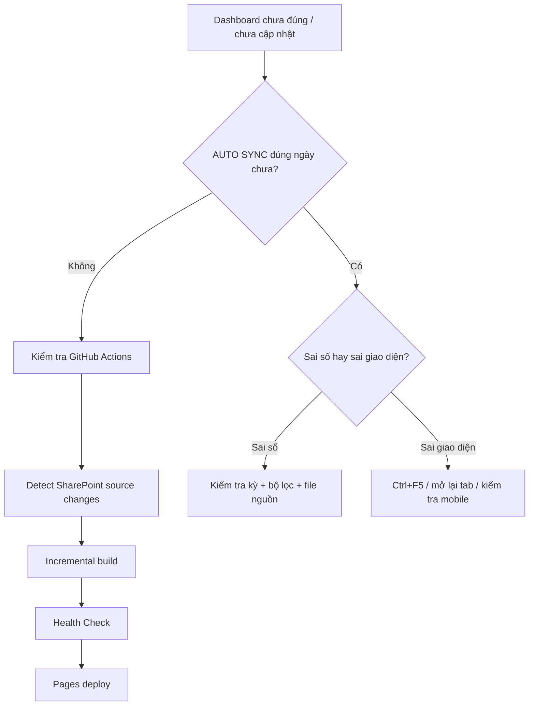

<div align="center">

# VIKODA SELL-IN DASHBOARD

**SharePoint → Incremental ETL → Data_Goc → Web Dashboard → GitHub Pages**

[](https://github.com/Huanpro1239/vikoda-sellin-dashboard/actions/workflows/vikoda_pipeline.yml)

### [MỞ DASHBOARD VIKODA](https://huanpro1239.github.io/vikoda-sellin-dashboard/)

</div>

---

## Dành cho nhân viên Vikoda

Nếu bạn chỉ cần **xem báo cáo**, không cần đọc phần kỹ thuật.

1. Mở dashboard bằng link phía trên.
2. Chọn kỳ báo cáo và bộ lọc cần xem.
3. Đọc 5 KPI chính: `Actual · Cùng kỳ · Target · % Đạt Target · Tăng trưởng`.

Trên điện thoại, dashboard tự chuyển sang giao diện mobile: có thanh điều hướng phía dưới, bộ lọc dạng drawer và các biểu đồ/bảng rộng có thể vuốt ngang.

**Hướng dẫn sử dụng cho nhân viên:** [HUONG_DAN_NHAN_VIEN_VIKODA.md](HUONG_DAN_NHAN_VIEN_VIKODA.md)

---

## Dashboard có gì?

| Trang | Nội dung chính |
|---|---|
| **01. Tổng quan** | Xu hướng Actual/Cùng kỳ/Target, Top Vùng, Top Group Brand/SKU |
| **02. Vùng - Miền** | Xu hướng và ma trận Miền → Vùng → Tỉnh |
| **03. Khách hàng** | Top khách hàng, tỷ trọng, diễn biến 12 tháng |
| **04. Sale quản lý** | Hiệu quả Vùng/Kênh, Target attainment, ma trận đơn vị, bảng chi tiết |
| **05. Sản phẩm** | Group Brand/Brand/SKU và xu hướng 12 tháng |
| **06. Chênh lệch** | Waterfall thiếu/vượt Target, Gap theo Vùng và bảng nguyên nhân |

---

# Hệ thống hoạt động như thế nào?



Hệ thống kiểm tra SharePoint theo lịch khoảng **30 phút/lần**. Nếu nguồn không đổi, workflow dừng trước ETL. Nếu nguồn đổi, chỉ phần cần thiết được xử lý lại.

---

## Ví dụ incremental

Nếu chỉ file ERP tháng 08/2026 thay đổi:



Mục tiêu là không xử lý lại toàn bộ lịch sử khi chỉ một tháng thay đổi.

---

## Luồng dữ liệu



SharePoint contract:

```text
Shared Documents/
└── Vikoda_Sales_Data/
    ├── Data ERP/
    ├── Target/
    ├── DanhMuc_KH/
    │   └── Thong tin khach hang.xlsx
    ├── DanhMuc_SP/
    │   └── Danh Muc San Pham.xlsx
    └── Data_Goc/
        ├── Sell in Txx_yyyy.xlsx
        ├── _vikoda_pipeline_state.json
        └── _vikoda_incremental_state.json
```

---

## Trạng thái nào được phép lên web?

Dashboard chỉ được deploy sau khi các bước kiểm tra chính thành công:

```text
Data source
  ↓
Incremental ETL
  ↓
Data Quality PASS
  ↓
System Health PASS
  ↓
JavaScript syntax PASS
  ↓
Web regression PASS
  ↓
GitHub Pages deploy
```

Nếu pipeline lỗi trước bước deploy, bản dashboard đang chạy không bị thay bằng một bản build lỗi.

---

## Giao diện di động

Mobile V6 hỗ trợ:

- iPhone/Android ở chế độ dọc và ngang;
- thanh điều hướng 6 trang cố định phía dưới;
- bộ lọc mở dạng drawer;
- backdrop để đóng bộ lọc nhanh;
- vùng chạm tối thiểu phù hợp màn hình cảm ứng;
- KPI 2 cột;
- biểu đồ 12 tháng vuốt ngang thay vì ép nhỏ;
- bảng/matrix vuốt ngang và dọc;
- `safe-area` cho iPhone có home indicator;
- tự resize ECharts khi xoay màn hình.

Các file mobile:

```text
web/css/mobile-v6.css
web/js/mobile-v6.js
web/tests/mobile-v6.test.js
```

---

# Dành cho người vận hành / bảo trì

## Trigger workflow

| Trigger | Hành vi |
|---|---|
| Pull request | Python/Web regression + hygiene |
| Push `main` | Read-only CI |
| Schedule `*/30 * * * *` | Kiểm tra metadata SharePoint |
| Không thay đổi | Dừng trước ETL |
| Có thay đổi | Incremental build + deploy Pages |
| Manual dispatch | Force refresh + deploy Pages |

Workflow production:

```text
.github/workflows/vikoda_pipeline.yml
```

---

## Chạy thủ công

```text
GitHub
→ Actions
→ Vikoda Sell-In Pipeline
→ Run workflow
→ Branch: main
→ run_cloud_refresh = true
```

Sau khi build code giao diện mới, nên tạo **run mới trên `main`**, không rerun một workflow cũ có SHA cũ.

---

## Microsoft Entra / Graph

Repository Variables bắt buộc:

```text
AZURE_TENANT_ID
AZURE_CLIENT_ID
```

Production dùng:

```text
GitHub OIDC
Microsoft Entra Federated Credential
Microsoft Graph
Sites.Selected
```

Không dùng `AZURE_CLIENT_SECRET` dài hạn.

Cấu hình SharePoint mặc định:

```text
SHAREPOINT_HOSTNAME=vikodacomvn.sharepoint.com
SHAREPOINT_SITE_PATH=/sites/Planning
SHAREPOINT_BASE_FOLDER=Vikoda_Sales_Data
SHAREPOINT_PIPELINE_STATE_FILE=_vikoda_pipeline_state.json
SHAREPOINT_INCREMENTAL_STATE_FILE=_vikoda_incremental_state.json
```

---

## Runtime web

Pipeline tạo trong runner:

```text
web/data/dashboard_data.json
web/data/dashboard_data.js
```

Hai file này không commit trực tiếp vào Git. Chúng được build trong workflow rồi đưa vào GitHub Pages artifact.

---

## Kiểm tra trước release

```bash
python -m pip install -r requirements.txt
python code/run_all_tests.py --quiet
npm run verify:web
```

Health check production:

```bash
python code/health_check.py
```

---

## File quan trọng

```text
.github/workflows/vikoda_pipeline.yml

code/common/sharepoint_change_detector_v2.py
code/common/incremental_cloud_pipeline.py
code/common/sharepoint_bootstrap.py
code/Skill/skill-bao-cao/scripts/export_web_data.py
code/health_check.py

web/index.html
web/css/executive-dashboard.css
web/css/reference-fidelity-v4.css
web/css/page05-sale-v5.css
web/css/mobile-v6.css

web/js/data-engine.js
web/js/charts.js
web/js/executive-ui.js
web/js/reference-fidelity-v4.js
web/js/page05-sale-v5.js
web/js/mobile-v6.js
web/js/app.js
```

---

## Khi có lỗi nên kiểm tra gì?



Các lỗi kỹ thuật phổ biến và cách xử lý chi tiết nằm trong runbook.

---

## Tài liệu

- **Nhân viên Vikoda:** [HUONG_DAN_NHAN_VIEN_VIKODA.md](HUONG_DAN_NHAN_VIKODA.md)
- **Runbook kỹ thuật:** [HUONG_DAN_SHAREPOINT_GITHUB_ACTIONS.md](HUONG_DAN_SHAREPOINT_GITHUB_ACTIONS.md)

---

## Lưu ý GitHub Pages

Theo cấu hình hiện tại, GitHub Pages publish **đầy đủ dữ liệu dashboard** được tạo từ pipeline. Không có bước ẩn danh hoặc mã hóa payload trước deploy.

GitHub Pages là public static hosting; người có URL có thể truy cập dashboard.
