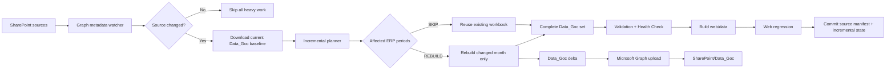

<div align="center">

# VIKODA SELL-IN DATA PLATFORM

**SharePoint → Microsoft Graph → GitHub Actions OIDC → Incremental Python ETL → Data_Goc + Executive Web Dashboard**

Nền tảng Sell-In cloud-first, secretless và fail-closed: tự phát hiện workbook nguồn thay đổi trên SharePoint, chỉ rebuild tháng bị ảnh hưởng, chỉ upload phần Data_Goc thay đổi và build lại dashboard từ bộ dữ liệu hoàn chỉnh.

[](https://github.com/Huanpro1239/vikoda-sellin-dashboard/actions/workflows/vikoda_pipeline.yml)


</div>

> **Production path:** SharePoint Online → Microsoft Graph → GitHub Actions OIDC → incremental monthly rebuild → `Data_Goc` delta upload → Web Dashboard.
>
> **Data security:** production customer/revenue data is never committed. Public Pages remains gated to `public-or-sanitized` payloads.

## Why this project

- **Change-aware:** nếu SharePoint không đổi thì không download/ETL/upload.
- **Incremental Data_Goc:** nếu ERP tháng 08 thay đổi thì chỉ `Sell in T08_YYYY.xlsx` được rebuild và upload; các tháng khác giữ nguyên.
- **Reuse baseline:** Data_Goc hiện có trên SharePoint được tải làm baseline, nên dashboard vẫn có đủ lịch sử dù chỉ một tháng được rebuild.
- **Target/catalog efficient:** Target, DanhMuc_KH hoặc DanhMuc_SP thay đổi có thể rebuild báo cáo/web mà không bắt buộc tạo lại toàn bộ monthly workbook.
- **No Power Automate Premium:** Microsoft Graph là lớp cloud I/O.
- **No long-lived client secret:** GitHub OIDC + Microsoft Entra Federated Credential.
- **Fail-closed:** thiếu baseline, source, quality PASS hoặc web artifact mới thì run dừng.
- **Executive dashboard:** sáu màn hình điều hành, năm KPI toàn cục, cross-filter, ECharts và Excel export.

## Incremental architecture



### Example

Nếu SharePoint chỉ cập nhật:

```text
Data ERP/..._Vikoda_T08_2026.xlsx
```

pipeline sẽ xử lý theo hướng:

```text
20 workbook Data_Goc hiện có
        ↓ baseline
Planner xác định 2026-08 = REBUILD
        ↓
Rebuild Sell in T08_2026.xlsx
        ↓
19 workbook cũ + 1 workbook mới
        ↓
Build dashboard từ đủ 20 tháng
        ↓
Upload chỉ:
  Sell in T08_2026.xlsx
  _vikoda_incremental_state.json
```

Không upload lại 19 workbook không đổi.

## Two-level state model

Watcher theo dõi `.xlsx/.xlsm` trong:

```text
Vikoda_Sales_Data/Data ERP
Vikoda_Sales_Data/Target
Vikoda_Sales_Data/DanhMuc_KH
Vikoda_Sales_Data/DanhMuc_SP
```

### Source manifest checkpoint

```text
Vikoda_Sales_Data/Data_Goc/_vikoda_pipeline_state.json
```

Lưu fingerprint + manifest metadata của source sau run thành công. Metadata gồm path, size, `lastModifiedDateTime`, `eTag`, `cTag`.

### Incremental monthly checkpoint

```text
Vikoda_Sales_Data/Data_Goc/_vikoda_incremental_state.json
```

Lưu source/output state theo tháng để planner quyết định `REBUILD` hay `SKIP` ở lượt sau.

State chỉ được ghi sau khi pipeline thành công. Run fail không được đánh dấu là đã xử lý.

> Trigger hiện là **polling 30 phút**, không phải webhook tức thời. Khi không có thay đổi, job chỉ làm metadata check rồi dừng.

## Executive Dashboard v2.5

Giao diện điều hành:

```text
01. Tổng quan
02. Vùng - Miền
03. Khách hàng
04. Sale quản lý
05. Sản phẩm
06. Chênh lệch
```

Global KPIs:

```text
Actual | Cùng kỳ | Target | % Đạt Target | Tăng trưởng
```

Global filters gồm kỳ báo cáo, Kênh, Miền, Vùng và Group Brand/Nhóm SP. Runtime web data được build atomically vào:

```text
web/data/dashboard_data.json
web/data/dashboard_data.js
```

Production copies không được commit vào Git.

## SharePoint contract

```text
Shared Documents/
└── Vikoda_Sales_Data/
    ├── Data ERP/
    ├── Target/
    ├── DanhMuc_KH/
    │   └── Thong tin khach hang.xlsx
    ├── DanhMuc_SP/
    │   └── Danh Muc San Pham.xlsx
    └── Data_Goc/
        ├── Sell in Txx_yyyy.xlsx
        ├── _vikoda_pipeline_state.json
        └── _vikoda_incremental_state.json
```

`Data_Goc` là managed output. Không chỉnh tay workbook trong đây nếu không có quy trình đối soát riêng.

## Trigger behavior

| Trigger | Behavior |
|---|---|
| Pull request | Hygiene + Python/Web regression |
| Push `main` | Read-only CI |
| Schedule `*/30 * * * *` | Check SharePoint; không đổi thì dừng |
| Source changed | Baseline + incremental planner + dashboard build |
| ERP month changed | Chỉ rebuild/upload tháng bị ảnh hưởng |
| Manual dispatch | Force kiểm tra pipeline; planner vẫn ưu tiên incremental |

Manual production validation:

```text
GitHub → Actions → Vikoda Sell-In Pipeline → Run workflow
run_cloud_refresh = true
publish_dashboard = false
```

## Configuration

Required Repository Variables:

```text
AZURE_TENANT_ID
AZURE_CLIENT_ID
```

Optional/default:

```text
SHAREPOINT_HOSTNAME=vikodacomvn.sharepoint.com
SHAREPOINT_SITE_PATH=/sites/Planning
SHAREPOINT_BASE_FOLDER=Vikoda_Sales_Data
SHAREPOINT_PIPELINE_STATE_FILE=_vikoda_pipeline_state.json
SHAREPOINT_INCREMENTAL_STATE_FILE=_vikoda_incremental_state.json
```

Production không đọc `AZURE_CLIENT_SECRET`.

Recommended Graph authorization:

```text
Application permission: Sites.Selected
Planning site role: write
```

## Web publishing safety

Dashboard production chứa customer/revenue-level information nên phải xem là **internal**. GitHub Pages là public static hosting; JavaScript password không phải access-control boundary.

Giữ:

```text
ENABLE_PAGES_DEPLOY=false
WEB_DATA_CLASSIFICATION=internal
```

Chỉ dữ liệu đã sanitize/approve mới bật:

```text
ENABLE_PAGES_DEPLOY=true
WEB_DATA_CLASSIFICATION=public-or-sanitized
```

## Local development

```bash
python -m pip install -r requirements.txt
python code/run_all_tests.py --quiet
npm run verify:web
```

## Repository map

```text
.github/workflows/vikoda_pipeline.yml          # watcher + incremental cloud + web gate
code/common/sharepoint_change_detector.py      # Graph fingerprint primitives
code/common/sharepoint_change_detector_v2.py   # per-file manifest + changed ERP periods
code/common/incremental_cloud_pipeline.py      # Data_Goc baseline/rebuild/delta orchestration
code/common/sharepoint_bootstrap.py            # site/drive resolution
code/Skill/sell-in-monthly/scripts/incremental.py
                                                # monthly REBUILD/SKIP planner
code/Skill/sell-in-monthly/scripts/extract_sources.py
                                                # supports --plan-file
code/Skill/skill-bao-cao/                      # reporting + Graph sync + web export
web/index.html                                 # Executive shell
web/css/executive-dashboard.css                # dashboard design system
web/js/data-engine.js                          # calculation/filter contract
web/js/charts.js                               # ECharts visualizations
web/js/executive-ui.js                         # KPI/header/dynamic filters
web/js/app.js                                  # application controller
```

Detailed operations: [`HUONG_DAN_SHAREPOINT_GITHUB_ACTIONS.md`](HUONG_DAN_SHAREPOINT_GITHUB_ACTIONS.md). Security: [`SECURITY.md`](SECURITY.md). Audit: [`PROJECT_AUDIT.md`](PROJECT_AUDIT.md).

---

**Keywords:** SharePoint automation · Microsoft Graph · GitHub Actions · OIDC · Microsoft Entra · Python ETL · incremental ETL · Excel automation · Sell-In analytics · ECharts · executive dashboard.
