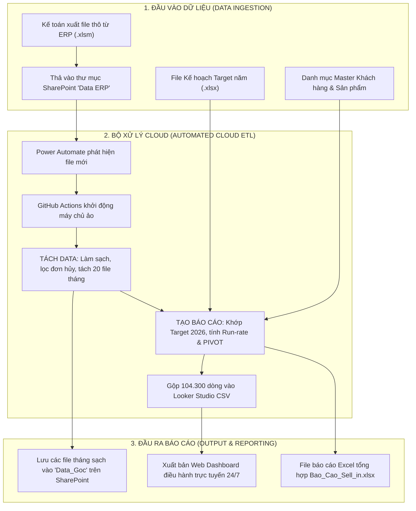

# 🌊 VIKODA | SELL-IN MANAGEMENT & AUTOMATION PLATFORM
### Nền tảng Quản trị & Tự động hóa Báo cáo Doanh số Sell-In Vikoda

[](#-2-truy-cập-web-dashboard-điều-hành)
[](https://github.com/Huanpro1239/vikoda-sellin-dashboard/actions)
[](https://www.python.org/)
[](#-2-truy-cập-web-dashboard-điều-hành)

---

> **Cảnh báo bảo mật:** GitHub Pages là static hosting. Màn hình mật khẩu chạy
> phía trình duyệt chỉ là lớp UX, không bảo vệ file dữ liệu khỏi tải trực tiếp.
> Không xuất bản dữ liệu khách hàng/doanh thu nội bộ trước khi có access control
> phía server hoặc identity proxy và phê duyệt dữ liệu. Xem
> [`SECURITY.md`](SECURITY.md) và [`PROPRIETARY_NOTICE.md`](PROPRIETARY_NOTICE.md).

---

## 📌 1. TỔNG QUAN HỆ THỐNG (EXECUTIVE SUMMARY)

Hệ thống **Vikoda Sell-In Platform** là giải pháp tự động hóa toàn diện quy trình xử lý dữ liệu bán hàng Sell-In của Công ty Cổ phần Nước khoáng Khánh Hòa (Vikoda 1979):
* **Xử lý dữ liệu lớn:** Tự động chuẩn hóa và phân tích hơn **104.300 dòng đơn hàng** từ 20 kỳ kinh doanh (từ Tháng 01/2025 đến nay).
* **Đa chiều phân tích:** Đánh giá doanh thu thực tế (Actual), kế hoạch mục tiêu (Target), cùng kỳ năm trước (LY), nhịp độ bán hàng (Pacing Run-rate) theo 20 Vùng kinh doanh, 4 Kênh phân phối (GT, MT, KA, B2C) và cơ cấu nhóm sản phẩm (Két, Thùng, Bình 19L).
* **Tự động hóa đám mây 24/7:** Kết nối liền mạch từ **Microsoft SharePoint** $\rightarrow$ **GitHub Actions** $\rightarrow$ **Web Dashboard Trực Tuyến** mà không cần duy trì máy chủ vật lý hay bật máy tính cá nhân.

---

## 🌐 2. TRUY CẬP WEB DASHBOARD ĐIỀU HÀNH

* 🔗 **Đường dẫn xem báo cáo:** URL nội bộ do quản trị viên/IT cấp sau khi hoàn tất phê duyệt dữ liệu và access control.
* 🔐 **Quyền truy cập:** Chỉ triển khai sau khi artifact đã qua data-classification review/phê duyệt và site nằm sau cơ chế xác thực thật. Không lưu hoặc công bố mật khẩu trong source/tài liệu.
* 📱 **Hỗ trợ thiết bị:** Tối ưu hóa giao diện điều hành chuẩn quốc tế trên cả **Máy tính để bàn, Laptop, Tablet và Điện thoại di động (Mobile-First UX)**.

---

## 🔄 3. KIẾN TRÚC VẬN HÀNH TỰ ĐỘNG (DATA PIPELINE ARCHITECTURE)



---

## 📂 4. CẤU TRÚC THƯ MỤC DỰ ÁN (PROJECT STRUCTURE)

```
d:/Vikoda/Bao cao Sell in/
├── 📁 .github/workflows/          # Kịch bản tự động hóa GitHub Actions 24/7 (deploy_dashboard.yml)
├── 📁 Chay CT/                    # Bộ nút bấm 1-click chạy thủ công trên máy tính Windows
│   ├── ⚡ Tach data.cmd           # Chạy riêng bước Tách Data Sell In hàng tháng
│   ├── ⚡ Bao cao Target.cmd      # Chạy trọn gói bước Tạo Báo Cáo Excel & PIVOT
│   ├── ⚡ Bao cao Power BI.cmd    # Mở và làm mới dữ liệu Power BI Desktop
│   └── 🤖 Tu dong chay khi SharePoint cap nhat.cmd # Bộ theo dõi ngầm tự chạy khi có file mới
├── 📁 code/                       # Mã nguồn xử lý lõi bằng Python
│   ├── 📁 Skill/sell-in-monthly/  # Module chuyên trách Tách Data (extract_sources, build_outputs)
│   └── 📁 Skill/skill-bao-cao/    # Module chuyên trách Tạo Báo Cáo, Web Export, MCP Server
├── 📁 Data/                       # Thư mục lưu trữ dữ liệu có cấu trúc
│   ├── 📁 Data ERP/               # Chứa các file thô xuất từ phần mềm ERP (.xlsm)
│   ├── 📁 Data_Goc/               # Chứa các file báo cáo tháng sạch (Sell in T*.xlsx)
│   ├── 📁 Target/                 # Chứa file kế hoạch mục tiêu năm (Target sellin 2026.xlsx)
│   ├── 📁 Danh muc KH/            # Chứa file Master danh mục khách hàng
│   ├── 📁 Danh muc SP/            # Chứa file Master danh mục sản phẩm và quy cách
│   └── 📁 Danh Sach Sales/        # Danh sách nhân sự quản lý (RSM, ASM, Sales Rep)
├── 📁 web/                        # Mã nguồn giao diện Web Dashboard (HTML5, Vanilla CSS, JS)
│   ├── 📁 css/                    # Hệ thống thiết kế Dark Navy Executive & Responsive Mobile
│   ├── 📁 js/                     # Logic bộ lọc đa chiều và biểu đồ ECharts
│   └── 📁 data/                   # Artifact web sinh tự động; phải được phân loại trước khi publish
├── 📄 Quy_Trinh_Tu_Dong_Hoa_Bao_Cao_SellIn_Vikoda.docx # Tài liệu quy trình chuẩn hóa gửi Ban Giám Đốc
└── 📄 README.md                   # Hướng dẫn toàn diện về hệ thống
```

---

## 👥 5. HƯỚNG DẪN SỬ DỤNG THEO VAI TRÒ (USER GUIDES)

### 👔 Dành cho Ban Giám Đốc & Quản lý Kinh doanh
1. Mở URL nội bộ do quản trị viên/IT cấp; không dùng link static public cho dữ liệu sản xuất.
2. Xác thực qua cổng truy cập doanh nghiệp đã được quản trị viên phê duyệt. Không xem prompt JavaScript phía client là cơ chế bảo mật.
3. Sử dụng các bộ lọc ở thanh bên trái hoặc thanh điều hướng nhanh dưới đáy màn hình (trên điện thoại) để xem phân tích:
   * **01. Tổng quan điều hành:** Doanh thu Actual vs Target, Tăng trưởng YoY, Nhịp độ Pacing.
   * **02. Kênh & Khách hàng:** Phân bổ tỷ trọng GT/MT/KA và Top 20 khách hàng lớn nhất.
   * **03. Sản phẩm & Danh mục:** Doanh thu và sản lượng theo Két / Thùng / Bình 19L.
   * **04. Vùng miền & Sản lượng:** Phân bổ doanh số theo 20 vùng và tiến độ hoàn thành kế hoạch.
   * **05. Chi tiết KH & SP:** Bảng tra cứu chi tiết có tìm kiếm tức thì và **xuất Excel báo cáo**.
   * **06. Kế hoạch & Khuyến nghị:** Đề xuất chiến lược thúc đẩy nhịp độ bán hàng theo từng khu vực.

---

### 💼 Dành cho Kế toán / Sales Admin
* **Nhiệm vụ hàng tháng:** Chỉ cần xuất file báo cáo bán hàng từ phần mềm ERP và kéo thả vào thư mục **`Data ERP`** trên SharePoint.
* **Kết quả:** Sau 1 - 2 phút, thư mục **`Data_Goc`** trên SharePoint sẽ tự động sinh ra các file tháng sạch và Web Dashboard sẽ tự động cập nhật số liệu mới!

---

### 💻 Dành cho Kỹ sư / Chạy trên máy tính cá nhân
* **Cài dependency lõi:** `py -3.12 -m pip install -r requirements.txt`.
* **Công cụ tùy chọn:** `py -3.12 -m pip install -r requirements-optional.txt` chỉ khi cần xuất Word hoặc chạy local MCP server.
* **Chạy nhanh thủ công:** Nhấp đúp [`Chay CT/Tach data.cmd`](Chay%20CT/Tach%20data.cmd) hoặc [`Chay CT/Bao cao Target.cmd`](Chay%20CT/Bao%20cao%20Target.cmd).
* **Chạy ngầm tự động:** Nhấp đúp [`Chay CT/Tu dong chay khi SharePoint cap nhat.cmd`](Chay%20CT/Tu%20dong%20chay%20khi%20SharePoint%20cap%20nhat.cmd) để máy tự động theo dõi và xử lý khi có file mới.

---

### 🤖 Dành cho AI Agent (Antigravity / Claude Code / MCP)
Hệ thống đã tích hợp sẵn **Local MCP Server** chuẩn quốc tế tại:
`code/Skill/skill-bao-cao/scripts/pad_mcp_server.py`
Mọi AI Agent trên máy tính có thể gọi trực tiếp các công cụ:
* `trigger_vikoda_sellin_pipeline()`: Chạy trọn gói chuỗi Tách Data ERP và cập nhật Web Dashboard.
* `run_pad_flow(flow_name)`: Kích hoạt bất kỳ Flow nào trong Power Automate Desktop.
* `list_local_pad_flows()`: Quét danh sách Flow trên máy.

---

## 🔒 6. BẢO MẬT & ĐỘ TIN CẬY (SECURITY & RELIABILITY)

* **Ranh giới bảo mật:** Client-side hashing/prompt không phải access control. Dữ liệu nội bộ chỉ được phục vụ sau lớp xác thực phía server hoặc identity-aware proxy.
* **CI tối thiểu quyền:** Pull request chỉ chạy job read-only và không nhận production secrets. Deploy bị khóa bởi repository variable `ENABLE_PAGES_DEPLOY=true`, input xác nhận thủ công hoặc lịch đã duyệt, cùng GitHub environment protection.
* **Fail closed:** Cloud sync dừng khi thiếu bất kỳ credential bắt buộc hoặc khi SharePoint không trả về workbook `.xlsm`/`.xlsx` hợp lệ, tránh âm thầm dùng dữ liệu cũ.
* **Không ghi dữ liệu về Git:** Job deploy không commit/push workbook, raw data hay artifact ETL trở lại `main`.
* **Toàn vẹn dữ liệu:** Không chỉnh sửa file nguồn gốc ERP, tạo bản sao đối soát minh bạch.
* **Quy trình sự cố:** Xem hướng dẫn báo cáo riêng tư, thu hồi secret và xử lý lịch sử tại [`SECURITY.md`](SECURITY.md).

---

*Hệ thống được thiết kế và vận hành chuẩn hóa cho Công ty Cổ phần Nước khoáng Khánh Hòa — Vikoda 1979.*
