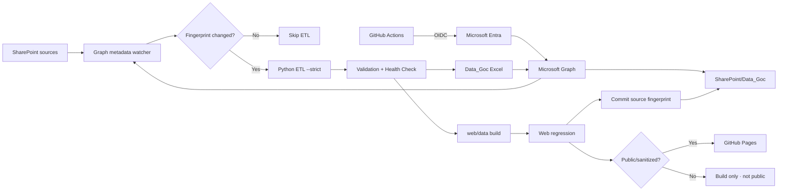

<div align="center">

# VIKODA SELL-IN DATA PLATFORM

**SharePoint → Microsoft Graph → GitHub Actions OIDC → Python ETL → Excel + Executive Web Dashboard**

Nền tảng Sell-In cloud-first, secretless và fail-closed: tự phát hiện workbook nguồn thay đổi trên SharePoint, chỉ chạy ETL khi cần, sinh Excel/Data_Goc và build dashboard điều hành theo cùng một nguồn dữ liệu chuẩn.

[](https://github.com/Huanpro1239/vikoda-sellin-dashboard/actions/workflows/vikoda_pipeline.yml)


</div>

> **Production path:** SharePoint Online → Microsoft Graph → GitHub Actions OIDC → Python ETL → `Data_Goc` + Web Dashboard.
>
> **Data security:** production customer/revenue data is never committed. Public Pages remains gated to `public-or-sanitized` payloads.

## Why this project

- **SharePoint change-aware:** checks workbook metadata every 30 minutes and rebuilds only when source data changes.
- **No Power Automate Premium:** Microsoft Graph is the cloud I/O layer.
- **No long-lived client secret:** GitHub OIDC + Microsoft Entra Federated Credential.
- **Fail-closed ETL:** stale/missing inputs or failed quality checks stop the run.
- **Executive dashboard:** six management views, five global KPIs, cross-filtering, ECharts and Excel export.
- **One calculation contract:** the new presentation shell keeps the proven `VikodaDataEngine` business calculations.

## Auto-refresh architecture



The watcher recursively monitors `.xlsx/.xlsm` in:

```text
Vikoda_Sales_Data/Data ERP
Vikoda_Sales_Data/Target
Vikoda_Sales_Data/DanhMuc_KH
Vikoda_Sales_Data/DanhMuc_SP
```

It fingerprints path, size, `lastModifiedDateTime`, `eTag` and `cTag`. Last successful state is stored at:

```text
Vikoda_Sales_Data/Data_Goc/_vikoda_pipeline_state.json
```

State is written only after ETL, health check, Data_Goc upload and web regression pass. A failed run therefore retries on the next poll.

> The trigger is **30-minute polling**, not an instant webhook. GitHub scheduled workflows can be delayed by platform load.

## Executive Dashboard v2.4

The interface follows the commercial-management layout used in the reference screens:

```text
01. Tổng quan
02. Vùng - Miền
03. Khách hàng
04. Sale quản lý
05. Sản phẩm
06. Chênh lệch
```

Global management KPIs:

```text
Actual | Cùng kỳ | Target | % Đạt Target | Tăng trưởng
```

Global filters include report period, Kênh, Miền, Vùng and Group Brand/Nhóm SP. Data is atomically rebuilt by `export_web_data.py` into:

```text
web/data/dashboard_data.json
web/data/dashboard_data.js
```

Those files are runtime artifacts and production copies are not committed to Git.

## SharePoint contract

```text
Shared Documents/
└── Vikoda_Sales_Data/
    ├── Data ERP/
    ├── Target/
    ├── DanhMuc_KH/
    │   └── Thong tin khach hang.xlsx
    ├── DanhMuc_SP/
    │   └── Danh Muc San Pham.xlsx
    └── Data_Goc/
        └── _vikoda_pipeline_state.json
```

## Triggers

| Trigger | Behavior |
|---|---|
| Pull request | Hygiene + Python/Web regression |
| Push `main` | Read-only CI |
| Schedule `*/30 * * * *` | Check SharePoint fingerprint; rebuild only on change |
| Manual dispatch | Force refresh when `run_cloud_refresh=true` |

Manual production test:

```text
GitHub → Actions → Vikoda Sell-In Pipeline → Run workflow
run_cloud_refresh = true
publish_dashboard = false
```

## Configuration

Required Repository Variables:

```text
AZURE_TENANT_ID
AZURE_CLIENT_ID
```

Optional/default:

```text
SHAREPOINT_HOSTNAME=vikodacomvn.sharepoint.com
SHAREPOINT_SITE_PATH=/sites/Planning
SHAREPOINT_BASE_FOLDER=Vikoda_Sales_Data
SHAREPOINT_PIPELINE_STATE_FILE=_vikoda_pipeline_state.json
```

Production does **not** read `AZURE_CLIENT_SECRET`.

Recommended Graph authorization:

```text
Application permission: Sites.Selected
Planning site role: write
```

## Web publishing safety

The reference dashboard contains customer/revenue-level information, which must be treated as **internal**. GitHub Pages is public static hosting and a JavaScript password is not an access-control boundary.

Keep:

```text
ENABLE_PAGES_DEPLOY=false
WEB_DATA_CLASSIFICATION=internal
```

Only sanitized/approved web data may enable:

```text
ENABLE_PAGES_DEPLOY=true
WEB_DATA_CLASSIFICATION=public-or-sanitized
```

Scheduled changed-data runs can then auto-deploy. Manual runs additionally require `publish_dashboard=true`.

## Local development

```bash
python -m pip install -r requirements.txt
python code/run_all_tests.py --quiet
npm run verify:web
```

## Repository map

```text
.github/workflows/vikoda_pipeline.yml        # watcher + ETL + web/deploy gates
code/common/sharepoint_change_detector.py    # SharePoint fingerprint/checkpoint
code/common/sharepoint_bootstrap.py          # site/drive resolution
code/Skill/sell-in-monthly/                  # Sell-In ETL
code/Skill/skill-bao-cao/                    # reporting + Graph sync + web export
web/index.html                               # Executive shell
web/css/executive-dashboard.css              # management dashboard design system
web/js/data-engine.js                        # calculation/filter contract
web/js/charts.js                             # ECharts visualizations
web/js/executive-ui.js                       # KPI/header/dynamic filters
web/js/app.js                                # application controller
```

Detailed operations: [`HUONG_DAN_SHAREPOINT_GITHUB_ACTIONS.md`](HUONG_DAN_SHAREPOINT_GITHUB_ACTIONS.md). Security: [`SECURITY.md`](SECURITY.md). Audit: [`PROJECT_AUDIT.md`](PROJECT_AUDIT.md).

---

**Keywords:** SharePoint automation · Microsoft Graph · GitHub Actions · OIDC · Microsoft Entra · Python ETL · Excel automation · Sell-In analytics · ECharts · executive dashboard.
