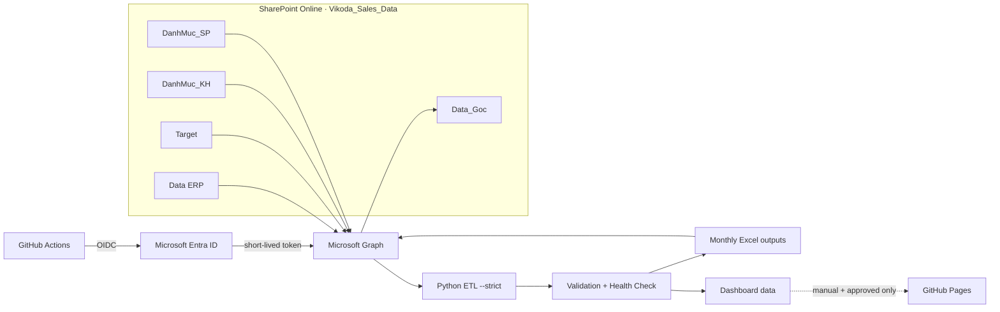

<div align="center">

# VIKODA SELL-IN DATA PLATFORM

**SharePoint → Microsoft Graph → GitHub Actions OIDC → Python ETL → Excel / Dashboard**

Nền tảng tự động hóa Sell-In theo hướng **secretless, fail-closed và cloud-first**: đọc dữ liệu nghiệp vụ từ SharePoint, xử lý bằng Python, kiểm tra chất lượng và ghi workbook đã chuẩn hóa trở lại SharePoint mà không cần Power Automate/Flow trung gian.

[](https://github.com/Huanpro1239/vikoda-sellin-dashboard/actions/workflows/vikoda_pipeline.yml)


</div>

> **Production architecture:** SharePoint Online → Microsoft Graph → GitHub Actions OIDC → Python ETL → SharePoint `Data_Goc`.
>
> **Security model:** không dùng Azure Client Secret dài hạn; production data không được commit vào Git; dashboard chỉ được publish khi đã phân loại `public-or-sanitized`.

## Tại sao dự án này đáng chú ý?

| Vấn đề | Cách dự án xử lý |
|---|---|
| Tự động hóa SharePoint nhưng không muốn phụ thuộc Power Automate Premium | GitHub Actions + Microsoft Graph |
| Không muốn lưu Client Secret dài hạn | GitHub OIDC + Microsoft Entra Federated Credential |
| Excel nguồn nhiều tháng, nhiều file | Python ETL chuẩn hóa và sinh workbook theo kỳ |
| Sợ pipeline dùng dữ liệu cũ rồi báo xanh giả | Thiết kế **fail-closed** và `--strict` |
| Cần bảo vệ dữ liệu khách hàng/doanh thu | Production data chỉ tồn tại ở SharePoint và runner tạm thời |
| Cần dashboard nhưng không muốn vô tình public dữ liệu nội bộ | Pages deployment có 3 lớp gate |
| Muốn vận hành không phụ thuộc máy cá nhân | Schedule chạy trên GitHub-hosted runner |

## Kiến trúc trong 60 giây



### 6 nguyên tắc thiết kế

1. **SharePoint là source of truth.** Git không phải kho workbook production.
2. **OIDC thay cho secret dài hạn.** GitHub nhận token ngắn hạn từ Entra cho đúng repository/branch.
3. **Graph là lớp I/O duy nhất của cloud pipeline.** Không dùng Flow/webhook trung gian.
4. **ETL fail-closed.** Thiếu nguồn, sai cấu hình hoặc validation lỗi thì dừng.
5. **CI và production tách quyền.** PR/push chỉ `contents: read`; cloud job mới có `id-token: write`.
6. **Publish là opt-in.** Dữ liệu nội bộ không tự động được đưa lên static hosting.

## Cấu trúc SharePoint production

Tên thư mục là một phần của interface giữa SharePoint và pipeline:

```text
Shared Documents/
└── Vikoda_Sales_Data/
    ├── Data ERP/
    ├── Target/
    ├── DanhMuc_KH/
    │   └── Thong tin khach hang.xlsx
    ├── DanhMuc_SP/
    │   └── Danh Muc San Pham.xlsx
    └── Data_Goc/
```

`Data_Goc` là đích ghi các workbook Sell-In đã xử lý. Pipeline không commit các file này trở lại repository.

## Quy trình production

```text
1. Checkout + install dependencies
2. Validate AZURE_CLIENT_ID / AZURE_TENANT_ID
3. azure/login bằng GitHub OIDC
4. Resolve SharePoint site + default drive
5. Download Data ERP
6. Download Target
7. Download DanhMuc_KH
8. Download DanhMuc_SP
9. run_cloud_pipeline.py --strict
10. finalize_data_dates.py
11. health_check.py
12. Verify Data/Data_Goc/*.xlsx
13. Upload Data_Goc qua Microsoft Graph
```

### Trigger

| Trigger | Mục đích | Cloud access |
|---|---|---:|
| Pull request | Repository hygiene + Python/Web regression tests | Không |
| Push `main` | Read-only CI | Không |
| Schedule `11:00 UTC` | Refresh production lúc **18:00 Việt Nam** | Có |
| Manual dispatch | Refresh ngay; tùy chọn publish dashboard | Có |

Workflow duy nhất:

```text
.github/workflows/vikoda_pipeline.yml
```

## Quick start cho quản trị viên

Cấu hình một lần theo [`HUONG_DAN_SHAREPOINT_GITHUB_ACTIONS.md`](HUONG_DAN_SHAREPOINT_GITHUB_ACTIONS.md). Sau đó để chạy ngay:

```text
GitHub
→ Actions
→ Vikoda Sell-In Pipeline
→ Run workflow

run_cloud_refresh = true
publish_dashboard = false
```

Kết quả đúng:

```text
Read-only CI                                   PASS
Refresh SharePoint and rebuild Sell-In outputs PASS
Deploy approved dashboard                     SKIPPED
```

`SKIPPED` ở dashboard là trạng thái mong muốn khi `publish_dashboard=false`.

## Cấu hình tối thiểu

Repository Variables bắt buộc:

```text
AZURE_TENANT_ID = <Directory tenant ID>
AZURE_CLIENT_ID = <Application client ID>
```

Không cần và production workflow không đọc:

```text
AZURE_CLIENT_SECRET
```

Các biến SharePoint có default trong workflow và chỉ cần tạo khi muốn override:

```text
SHAREPOINT_HOSTNAME
SHAREPOINT_SITE_PATH
SHAREPOINT_BASE_FOLDER
```

Production hiện dùng base folder:

```text
Vikoda_Sales_Data
```

`SHAREPOINT_SITE_ID` và `SHAREPOINT_DRIVE_ID` không cần cấu hình trong GitHub; `code/common/sharepoint_bootstrap.py` tự resolve ở mỗi cloud run.

## Microsoft Graph permission

Mô hình least-privilege được khuyến nghị và đang dùng:

```text
Application permission: Sites.Selected
Site: Planning
Role: write
```

Không cần `Sites.ReadWrite.All` nếu `Sites.Selected` đáp ứng yêu cầu.

## Chạy local

Yêu cầu:

```text
Python 3.12+
Node.js 24+
Azure CLI (chỉ khi test Graph local)
```

Cài dependency và chạy regression suite:

```bash
python -m pip install -r requirements.txt
python code/run_all_tests.py --quiet
npm run verify:web
```

Test Graph local:

```bash
az login --tenant <AZURE_TENANT_ID> --allow-no-subscriptions
python code/common/sharepoint_bootstrap.py
```

`AzureCliCredential` sẽ dùng phiên Azure CLI hiện tại. Các file `.cmd`/PowerShell trong `Chay CT/` là tiện ích Windows/local; chúng không phải production scheduler.

## Repository map

```text
.github/workflows/vikoda_pipeline.yml   # CI + scheduled/manual cloud pipeline
code/common/                            # bootstrap, validation, date finalization
code/Skill/sell-in-monthly/             # ETL Sell-In theo tháng
code/Skill/skill-bao-cao/               # report pipeline + Graph sync
web/                                    # static dashboard + regression tests
Chay CT/                                # tiện ích local Windows
README.md                               # overview
HUONG_DAN_SHAREPOINT_GITHUB_ACTIONS.md  # production runbook
PROJECT_AUDIT.md                        # trạng thái audit gần nhất
SECURITY.md                             # security policy
AGENTS.md                               # guardrails cho automation/AI contributors
```

## Bảo mật và dữ liệu

- Không commit `Data/`, `web/data/`, `.env`, token hoặc workbook production.
- Không dùng Client Secret cho production workflow.
- Không xem mật khẩu JavaScript phía client là access control.
- Không publish customer/revenue-level data lên Pages nếu chưa sanitize và phê duyệt.
- Nếu dữ liệu production từng tồn tại trong lịch sử Git công khai, phải xem đó là một security incident riêng; `.gitignore` không xóa lịch sử.

Chi tiết: [`SECURITY.md`](SECURITY.md) và [`PROPRIETARY_NOTICE.md`](PROPRIETARY_NOTICE.md).

## Trạng thái production

Manual end-to-end validation gần nhất đã xác nhận toàn bộ luồng:

```text
OIDC login                     PASS
SharePoint site/drive resolve  PASS
ERP download                   PASS
Target download                PASS
Customer catalog download      PASS
Product catalog download       PASS
Strict ETL                     PASS
Health check                   PASS
Data_Goc upload                PASS
```

Bằng chứng và các rủi ro còn lại được ghi trong [`PROJECT_AUDIT.md`](PROJECT_AUDIT.md).

## English summary

**Vikoda Sell-In Data Platform** is a production-oriented example of a secretless SharePoint data pipeline built with **Microsoft Graph, GitHub Actions OIDC, Microsoft Entra ID, Python ETL and Excel automation**. It downloads operational workbooks from SharePoint, validates and transforms Sell-In data, generates monthly Excel outputs, and writes approved results back to SharePoint. Long-lived Azure client secrets and Power Automate are not required for the production path.

Keywords: `sharepoint`, `microsoft-graph`, `github-actions`, `oidc`, `microsoft-entra`, `python`, `etl`, `excel-automation`, `sales-analytics`, `data-pipeline`.

---

Nếu kiến trúc **SharePoint + Graph + OIDC + Python ETL** trong repository này hữu ích cho bạn, một ⭐ giúp dự án dễ được tìm thấy hơn.

**Vikoda Sell-In Data Platform — automated, testable, least-privilege.**
